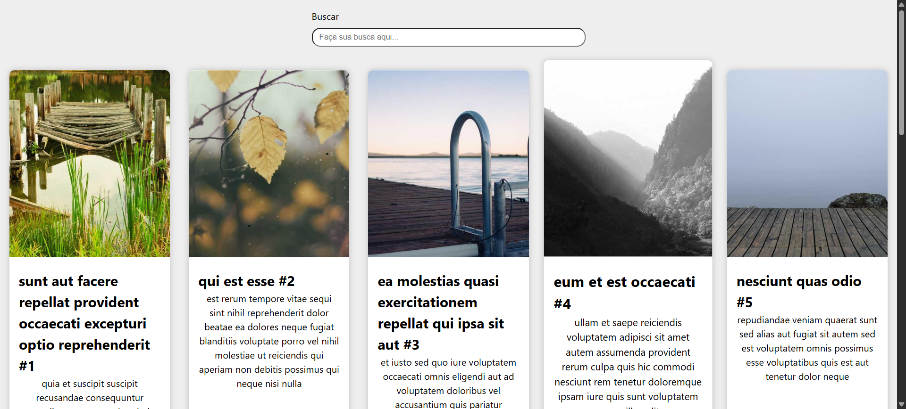
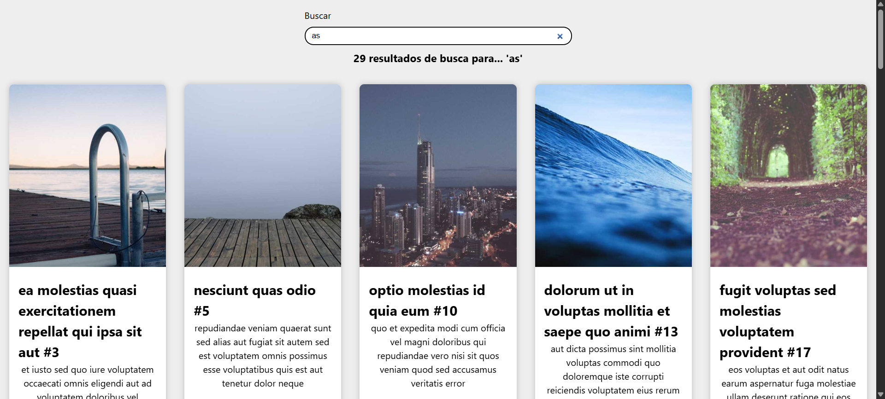

# Estudos sobre a Fetch API utilizando o JSONPlaceholder. Implementa uma galeria de cards que:

* Mapeia e exibe informações

* Possui um campo de busca para filtrar os resultados

* Fornece feedback visual ao usuário

* Inclui botões de paginação para navegação

* Layout responsivo

# Tecnologias Utilizadas

* React JS

* HTML, CSS e JavaScript

* Fetch API

# Como Executar

1. Clone este repositório!

2. No root do projeto: _npm i_ , para instalar as dependências.

3. Execute o projeto: _npm run dev_

# Demonstração

## Galeria

## Campo de busca e feedback para usuários

